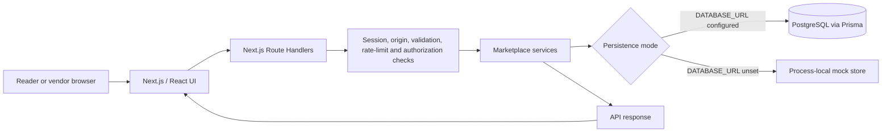
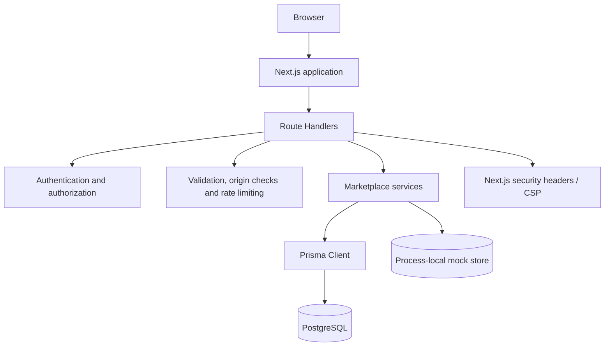

# MarketHub Technical Project & Security Assessment

**Assessment date:** 2026-10-06

**Repository:** https://github.com/praneethk399/MarketHub

**Branch and assessed commit:** `main`, `b42956c`
**Assessment scope:** Committed repository plus the working-tree service files present during review. Eight service files were untracked and reviewed; `sellerPassport.service.ts` appeared after the initial pass and received a separate follow-up review. These service files are not included in this report's commits.

> This record follows the sections in the supplied Build Secure Technical Project & Security Documentation template. Unknown project/team/deployment details are marked as not provided rather than inferred.

## 1. Project Overview

| Item | Description |
| --- | --- |
| Project name | MarketHub |
| Team name | Not provided in the repository or supplied project details |
| Team members | Not provided |
| Domain | Web application; e-commerce / independent-bookstore marketplace |
| Problem statement | Independent bookstores and readers need a marketplace to discover books and manage purchases and related account activity. A more specific hackathon problem statement was not provided. |
| Solution summary | A Next.js marketplace with book and product discovery, customer accounts, carts, checkout, orders, wishlists, addresses, reviews, and vendor-management APIs. It supports a local catalogue and optional PostgreSQL persistence. Checkout records simulated payment; no payment provider is integrated. |

## 2. Team Roles & Contributions

Team member names, roles, responsibilities, and individual contributions were not supplied. Complete this section with the registered team information before using this document as a final hackathon submission.

## 3. Project Workflow

1. A user interacts with the storefront or account interface.
2. The browser sends requests to Next.js Route Handlers.
3. Mutating routes and private operations apply request checks, authentication, authorization, validation, and rate limiting as applicable.
4. Services perform catalogue, account, cart, order, vendor, and related operations.
5. Data is read from or written to PostgreSQL through Prisma when configured; selected legacy flows use in-process mock data otherwise.
6. The handler returns a response to the user interface.

## 4. Technical Architecture

| Component | Implementation |
| --- | --- |
| Frontend | Next.js App Router, React, TypeScript, Tailwind CSS |
| Backend | Next.js Route Handlers and TypeScript services |
| Database | PostgreSQL through Prisma when `DATABASE_URL` is configured; process-local mock data for supported local flows |
| APIs / integrations | Internal REST-style `/api/*` endpoints; no external payment processor is integrated |
| Authentication / authorization | Server-side sessions in HTTP-only, SameSite cookies; bcrypt for new passwords; role and ownership checks in server-side routes/services |
| Deployment | No hosting platform, deployment URL, or production configuration was provided or verified |
| Other technologies | Prisma, Zod, pnpm, Node.js |

The browser communicates with the Next.js application. Route Handlers apply request-level controls and call service-layer business logic. Persistence is selected according to database configuration. The process-local mock store and rate limiter are not shared across application instances and are not durable substitutes for production infrastructure.

## 5. Key Features & Implementation

| Feature | Implementation / description |
| --- | --- |
| Book and product discovery | Catalogue and product APIs with search and filtering |
| Customer accounts | Registration, login, logout, and current-session APIs |
| Cart and checkout | Server-side cart operations; checkout calculates authoritative prices and updates inventory; payment is simulated |
| Orders and addresses | Customer-scoped order and address APIs |
| Wishlists and reviews | Customer wishlist; reviews are intended to require a qualifying purchase |
| Vendor marketplace | Vendor applications, product management, and administrative approval/suspension APIs |
| Social and privacy services | Additional service modules were present in the working tree and included in the static review; these modules remain untracked at the assessment commit |

## 6. Security Implementation

### Security approach

The reviewed application uses server-side identity and authorization checks, input validation, bounded JSON request handling, origin checks for browser mutations, rate limits for sensitive operations, and configured browser security headers. These controls reduce common risks such as unauthorized object access, cross-site request forgery, oversized request bodies, and credential exposure. The process-local rate limiter is not suitable as a shared control across multiple production instances.

### Implementation details

- New passwords are hashed with bcrypt; the documented legacy scrypt flow upgrades hashes after successful authentication.
- Session cookies are HTTP-only and SameSite; session tokens are opaque and their hashes are stored server-side.
- Role and ownership checks are performed server-side for private operations.
- Product/vendor and customer/order operations are scoped to the authenticated identity.
- Request JSON size is bounded; mutating cookie-authenticated browser requests check `Origin` when it is present.
- Sensitive writes use a process-local rate limiter.
- Next.js is configured with a Content Security Policy and standard browser security headers; HSTS is enabled in production.
- No raw dynamic SQL was identified in the reviewed application search; the only raw SQL match was a fixed health-check query.

### Security architecture / flow

### Security validation and findings

The static source review covered authentication, authorization, input validation, Prisma access, request-origin checks, rate limiting, configuration/secrets, security headers, API routes, and the working-tree service files. It found **no actionable source-code vulnerabilities** in the reviewed scope. Static review is not proof that the application is free of vulnerabilities.

The full dependency audit did identify two HIGH-severity advisories in the dependency tree:

| # | Severity | Package (resolved version) | Lockfile line | Advisory / issue | Dependency path | Recommended action |
| --- | --- | --- | --- | --- | --- | --- |
| 1 | HIGH | `effect` `3.18.4` | `pnpm-lock.yaml:782` | [GHSA-38f7-945m-qr2g](https://github.com/advisories/GHSA-38f7-945m-qr2g): `AsyncLocalStorage` context may be lost or contaminated in concurrent RPC work; affected versions `<3.20.0` | `@prisma/config@6.19.0` through Prisma | Upgrade to a compatible Prisma release that resolves `effect` to `>=3.20.0`, then rerun the audit and validation. |
| 2 | HIGH | `deepmerge-ts` `7.1.5` | `pnpm-lock.yaml:764` | [GHSA-ggr8-5vv4-36mx](https://github.com/advisories/GHSA-ggr8-5vv4-36mx): stack exhaustion when merging recursive object graphs; affected versions `<8.0.0` | `@prisma/config@6.19.0` through Prisma | Upgrade to a compatible Prisma release that resolves `deepmerge-ts` to `>=8.0.0`, then rerun the audit and validation. |

`corepack pnpm audit --prod` reported no known vulnerabilities in the production-only dependency audit. The two advisories above were reported by the full dependency audit. Confirm reachability and production impact after selecting compatible patched Prisma dependencies.

No dynamic penetration test was run. Strix was not run because Docker was unavailable and neither `STRIX_LLM` nor `LLM_API_KEY` was configured. No deployed target URL was supplied, and no external application was probed.

## 7. Testing & Validation

### Testing approach

Validation used the repository's existing package manager and schema tooling, a production build attempt, and a read-only static source security review. No test files or test script were present in the inspected repository inventory.

### Test cases / scenarios

| Test / check | Expected result | Actual result | Status |
| --- | --- | --- | --- |
| Static source review for backdoors, injection sinks, access-control flaws, and relevant security controls | No actionable exploitable issues in the reviewed scope | No actionable source-code vulnerabilities reported by the review | Pass, with static-review limitations |
| `corepack pnpm audit --prod` | No known production dependency advisories | No known vulnerabilities found | Pass |
| `corepack pnpm audit` | No known advisories across dependency groups | Two HIGH advisories: `effect@3.18.4` and `deepmerge-ts@7.1.5` | Fail |
| `npm audit --omit=dev --no-fund --no-progress` | Audit using an npm lockfile | Could not run: this project has `pnpm-lock.yaml`, not `package-lock.json` | Not applicable; pnpm audit was used |
| `npm run build` | Production build and TypeScript validation succeed | Compilation completed, but TypeScript parsing failed at `services/list.service.ts:140` and `services/privacy.service.ts:136` | Fail |
| Prisma schema validation with a placeholder `DATABASE_URL` | Schema validates without contacting a database | Prisma reported the schema is valid | Pass |
| Dynamic penetration scan | Runtime scan completes against an authorized target | Not run: Docker/Strix prerequisites and a deployed target were unavailable | Not run |

The build errors are in working-tree service files and must be resolved before the application can receive successful build/type-check validation. The Prisma schema check used a placeholder URL and did not connect to a database.

## 8. Deployment & Final Validation

| Item | Status |
| --- | --- |
| Repository URL | https://github.com/praneethk399/MarketHub |
| Deployment URL | Not provided |
| Deployment process | Not verified; see the project README for local setup and optional PostgreSQL instructions |
| Final application state | Marketplace APIs/services are present in the assessed workspace; build validation is blocked by the reported TypeScript parse errors |
| Security status | Static source review found no actionable code-level vulnerability; two HIGH advisories remain in the full dependency tree |
| Known unresolved issues | Upgrade affected Prisma dependency chain; resolve the two TypeScript parse errors; rerun build, dependency audits, tests, and an authorized runtime penetration scan |

### Final validation

The full dependency audit, production-only dependency audit, Prisma schema validation, build attempt, and static source review were completed and recorded above. The application was not deployed or runtime penetration-tested. Team details, deployment details, and unresolved test/build issues should be updated before presenting this as final project-submission documentation.
